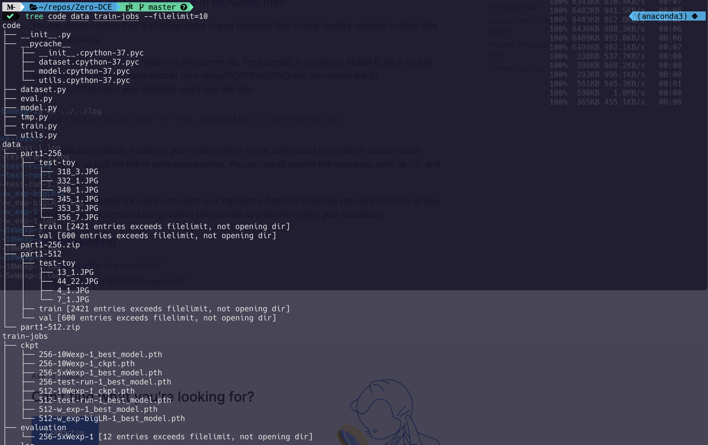

# Reproduce ZeroDCE

Link to the paper: [Zero-Reference Deep Curve Estimation for Low-Light Image Enhancement](https://arxiv.org/abs/2001.06826)


### Download SICE dataset [here](https://github.com/csjcai/SICE) 

prepare dataset with `code/dataset.py`(you need to modify the path in the source file) or prepare the dataset yourself.


Here is the directory structure of the dataset I'm using.

```bash
$ tree part1-256 --filelimit=10     

part1-256
├── test-toy
│   ├── 318_3.JPG
│   ├── 332_1.JPG
│   ├── 340_1.JPG
│   ├── 345_1.JPG
│   ├── 353_3.JPG
│   └── 356_7.JPG
├── train [2421 entries exceeds filelimit, not opening dir]
└── val [600 entries exceeds filelimit, not opening dir]
```


### Usage(Python>=3.6 is required as I used f-strings):

The hyper-parameters used are configured in a dictionary named `hp`in `train.py`.

```bash
# 256 here means image size
nohup python train.py --device=1 --experiment='256-5xWexp-1' \
    --baseDir=../data/part1-256 --numEpoch=300 >256.log 2>&1 &

python eval.py --device=0 --testDir=../data/part1-256/test-toy \
  --ckpt=../train-jobs/ckpt/256-5xWexp-1_best_model.pth 
```

Visualization and sanity checks can be found in `Demo.ipynb`


### File Structure

I reference to paths use relative path, so upon root directory, you need to create

*  a `code/` directory and put python files in it
* a `data/` directory and put subdirectory and data in it, considering modify `dataset.py` to your needs
* empty directories `train-jobs/log`,  `train-jobs/ckpt`, `train-jobs/evaluation` as log/checkpoing/results will be saved to them



